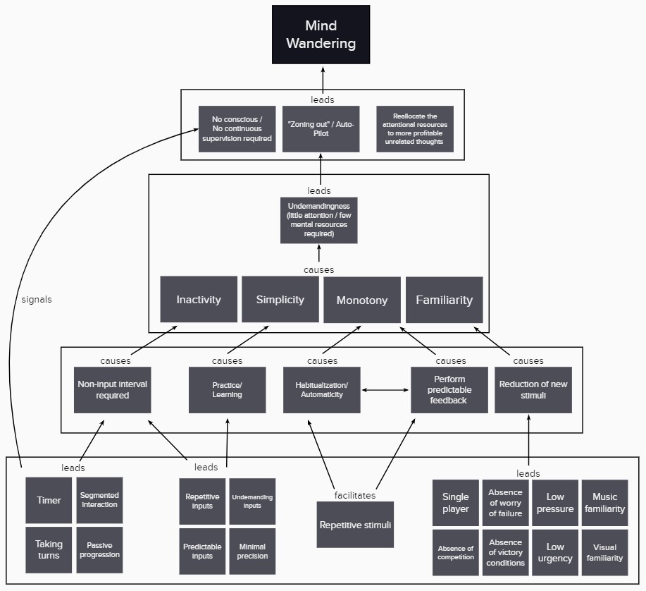

# MuseFlow

### Abstract
Mind-wandering, i.e., letting the mind drift away from the task at hand, is mostly seen as a state of mind to avoid, as it may negatively impact the current task. However, evidence in cognitive science shows that mind-wandering can also positively affect creativity and problem-solving. Still, there is a lack of technological solutions to facilitate and utilize mind-wandering in such a specific way. In this short paper, we present MuseFlow, a video game designed to facilitate mind-wandering deliberately. Our study shows that MuseFlow induces mind-wandering significantly more often compared to a demanding game condition while maintaining the players' motivation to play and succeed in the game. **Keywords:** mind-wandering, incubation effect, creativity, problem-solving, game mechanics, video game, creativity support tools, serious games

### Publication
Paper available: [MuseFlow: Facilitating Mind-Wandering Through Video Games](https://hci.w-hs.de/wp-content/uploads/2021/06/pub_MuseFlow_INTERACT2021.pdf)
 
Poster: [MuseFlow: Mind-Wandering and Video Games] https://www.researchgate.net/publication/353046179_MuseFlow_Mind-Wandering_and_Video_Games

### Online Game
Play the game and get Eureka! moments: [MuseFlow online game](https://juanolaya.github.io/MuseFlow/index.html)

### Technical Implementation
MuseFlow was developed using the JavaScript library [p5.js](https://p5js.org/) integrated with HTML and CSS. The back-end were implemented using PHP and SQL. We invite interested researchers to contribute to this project.

### Screeshot
Player is obstructed by a platform

  

### Model
Model to Promote Mind-Wandering using Undemanding Game Mechanics

  

